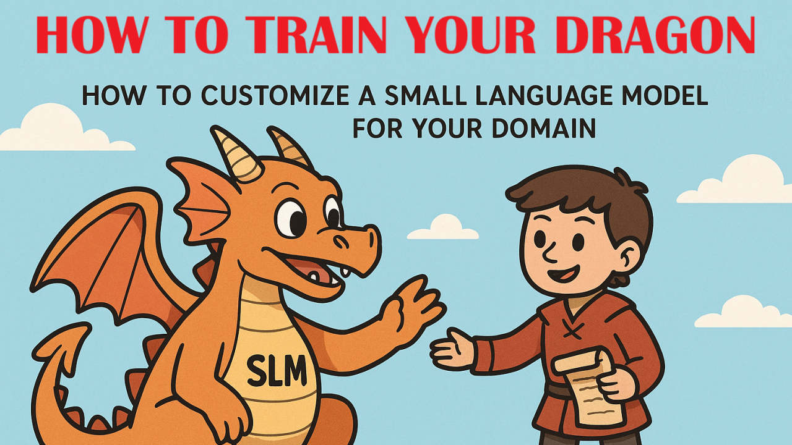

# Dragon Trainer Lab Series
How to Customize a Small Language Model (SLM) for Your Domain



This repository contains a 7-part lab series that walks you through fine-tuning a Small Language Model (SLM) with LoRA + Unsloth on the ncbi/Open-Patients dataset.  
The theme follows our blog series **"How to Train Your Dragon"**, where each lab builds on the last — from environment setup to packaging your trained model for release.

## Lab Overview

- **Lab 1 – Environment Setup (Colab & Local)**  
  Two versions provided:  
  - **Colab:** GPU check, PyTorch auto-install, Unsloth and dependencies, test model load & inference  
  - **Local:** Conda environment, CUDA-specific Torch install, Unsloth & dependencies, test model load & inference

- **Lab 2 – Base Model Loading and Inference**  
  Load a base SLM (Mistral or Llama-2), run prompts, explore generation parameters.

- **Lab 3 – Data Loading and Tokenization**  
  Load the ncbi/Open-Patients dataset, clean, split, and tokenize for causal LM training.

- **Lab 4 – LoRA Fine-Tuning**  
  Attach LoRA adapters with Unsloth, run domain-adaptive continued pretraining.

- **Lab 5 – Hyperparameter Tuning and Optimization**  
  Sweep learning rates, LoRA ranks, sequence lengths for quality vs. speed trade-offs.

- **Lab 6 – Evaluation and Comparison**  
  Compare base vs. tuned model outputs, run perplexity evaluation, produce a qualitative report.

- **Lab 7 – Reproducible Packaging and Release**  
  Save LoRA adapters, create a model card, push to Hugging Face Hub.

## Dataset: ncbi/Open-Patients

- **Source:** Hugging Face Dataset Card  
- **Description:** 180k+ patient descriptions (medical domain)  
- **Key Field:** `description` (free-text clinical notes)  
- **License:** CC BY-SA 4.0 – derivatives must be shared under the same license  
- **Use Case in Labs:** Continued pretraining to adapt the base model to the medical domain

**Disclaimer:** Models trained on this dataset are for research and educational purposes only and not for clinical use.

## Prerequisites

### Google Colab
- GPU runtime enabled (T4 or better recommended)  
- Hugging Face account (for gated models like Llama-2)  
- Hugging Face CLI token if needed:
  ```python
  from huggingface_hub import login
  login()
  ```

### Local
- Python 3.10+  
- Conda environment  
- CUDA 11.8+ or 12.x with NVIDIA drivers  
- See `labs/local/lab1_local_setup.ipynb` for detailed install steps

## Repo Structure

```
labs/
  colab/
    lab1_colab_setup.ipynb
    lab2_colab_inference.ipynb
    lab3_colab_data_prep.ipynb
    ...
  local/
    lab1_local_setup.ipynb
    lab2_local_inference.ipynb
    lab3_local_data_prep.ipynb
    ...
data/
  prepare_open_patients.py
train/
  run.py
  config.json
eval/
  prompts_med.jsonl
utils/
  env_check.py
  seed.py
README.md
MODEL_CARD.md
requirements.txt
```

## Quick Start

### Colab
1. Open **Lab 1** in Colab.  
   - Enable GPU: Runtime → Change runtime type → Hardware accelerator: GPU  
   - Run all cells to install dependencies and test model load.
2. Proceed to **Lab 2** to load a base model and test inference.
3. Follow Labs 3–7 in sequence to prepare data, fine-tune, evaluate, and package your model.

### Local
1. Follow `labs/local/lab1_local_setup.ipynb` to set up your Conda environment and install dependencies.
2. Verify GPU availability and run the inference test script.
3. Continue with Labs 2–7 in the `local/` folder.

## Disclaimer
This project is for educational purposes only.  
The ncbi/Open-Patients dataset contains medical descriptions and is licensed under CC BY-SA 4.0.  
Any derivative model must comply with the share-alike license and must not be used for clinical decision-making.
